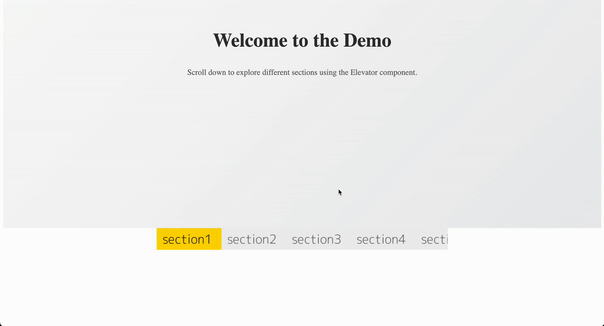
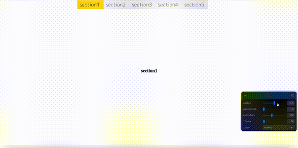

<sub>🌐 Looking for 中文版本？[Click here](./README.zh-CN.md) to switch.</sub>

---

# 🛗 ElevatorNav – Scroll Spy Navigation Component

A lightweight, visual scroll‑spy elevator navigation component for React.

### 📌 Demo 1: Auto anchor snapping with scroll position tracking


### 📌 Demo 2: Click to navigate anchor + dynamic image switching


### 📌 Demo 3: Parameter preview (tab count / width / padding)


> 🧭 This component is a modern alternative to `position: sticky` navigation bars, specifically built to **avoid issues where sticky fails**, such as inside iOS WebViews, scrollable modals, or nested containers. It uses `position: fixed` + placeholder compensation for full reliability.

---

## 🎬 Live Previews

#### 👉 [View Demo](https://ranceheart.github.io/sticky-elevator/)
#### 👉 [View Demo with param](https://ranceheart.github.io/sticky-elevator/?debug=1)

To try it locally:

```bash
yarn install
yarn dev
```

To build for demo and deploy to GitHub Pages:

```bash
yarn build:demo
yarn gh:deploy
```

---

## 📦 Installation

```bash
npm install @ranceheart/sticky-elevator
# or
yarn add @ranceheart/sticky-elevator
```

---

## 🔧 Usage

```tsx
import { Elevator } from '@ranceheart/sticky-elevator'

const anchors = ['section1', 'section2', 'section3'];
const imgs = anchors.map(id => `/images/${id}.png`);
const imgsActive = anchors.map(id => `/images/${id}-active.png`);

<Elevator
  anchorPoints={anchors}
  anchorImages={imgs}
  anchorActiveImages={imgsActive}
  number={3}
  paddingTab={0}
/>
```

Make sure your page contains sections with matching `id`s:

```html
<section id="section1">...</section>
<section id="section2">...</section>
<section id="section3">...</section>
```

---

## ⚙️ Props

| Prop               | Type              | Description                                                 |
|--------------------|-------------------|-------------------------------------------------------------|
| `anchorPoints`     | `string[]`        | Section IDs the elevator should scroll to and track         |
| `anchorImages`     | `string[]`        | Normal tab images                                           |
| `anchorActiveImages` | `string[]`      | Active tab images (fallbacks to `anchorImages` if missing)  |
| `number`           | `number`          | How many tabs to show per screen                            |
| `paddingTab`       | `number`          | Top padding when fixed (e.g., to avoid navbar overlap)      |
| `navbarHeight`     | `number`          | Optional height of external fixed nav (default: 50px)       |
| `className`        | `string`          | Additional class name for outer container                   |
| `style`            | `CSSProperties`   | Inline styles for elevator container                        |

---

## 🧪 Features

- 🌀 **ScrollSpy**: Realtime section tracking with scroll-end detection
- 📱 **Mobile-first**: Horizontal scroll with touch-friendly tabs
- 📌 **Sticky-safe**: Uses `fixed` instead of `sticky` to avoid platform bugs
- 🧵 **SCSS-ready**: Ships with fully scoped `elevator.scss`, easily themeable
- 🖼️ **Visual**: Tabs are image-driven, perfect for visually guided navigation

---

## ⚠️ Sticky Pitfalls Solved

`position: sticky` fails in these common cases:

- Inside `overflow: hidden` parents
- In iOS Safari + WebViews
- In scrollable modals or hybrid apps
- On older Android browser engines

🛗 Elevator avoids these by **using `fixed` positioning with intelligent placeholder elements**, so your layout stays stable and predictable.

---

## 📐 Architecture

- React hooks: `useEffect`, `useRef`, `useMemo`
- `ResizeObserver` for dynamic tab height changes
- `requestAnimationFrame` for smooth scroll tracking
- Polyfills: `smoothscroll-polyfill` for iOS support

---

## 🧱 License

MIT © [@RanceHeart](https://github.com/RanceHeart)

---
