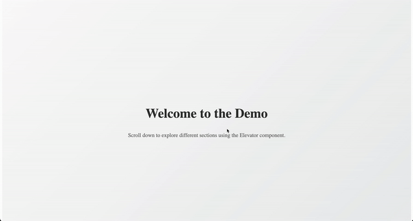

<sub>🌐 Looking for English Version？[Click here](./README.md) to switch.</sub>

---

# 🛗 ElevatorNav – 滚动锚点导航组件

一个轻量级的 React 视觉锚点导航（scroll-spy）组件。position: sticky在某些情况不好使(父元素要求太多), 在复杂的项目里不好改父元素的情况下，用这个替代需要sticky的导航栏

### 📌 Demo 1: 锚点自动吸附 + 自动滚动定位


### 📌 Demo 2: 点击跳转锚点 + 滑动切换图片显示


### 📌 Demo 3: 参数自定义效果预览（tab 数量 / 宽度 / padding）


> 🧭 本组件是对 `position: sticky` 导航条的现代替代方案，专为解决 sticky 在某些环境中失效的问题而设计，比如 iOS WebView、可滚动模态框、嵌套容器等场景。采用 `position: fixed` + 占位补偿，确保行为一致、可靠。

---

## 🎬 在线演示

#### 👉 [示例](https://ranceheart.github.io/sticky-elevator/)
#### 👉 [示例带参数](https://ranceheart.github.io/sticky-elevator/?debug=1)

本地运行：

```bash
yarn install
yarn dev
```

构建并部署到 GitHub Pages：

```bash
yarn build:demo
yarn gh:deploy
```

---

## 📦 安装

```bash
npm install @ranceheart/sticky-elevator
# 或者
yarn add @ranceheart/sticky-elevator
```

---

## 🔧 使用方法

```tsx
import { Elevator } from 'react-sticky-elevator'

const anchors = ['section1', 'section2', 'section3'];
const imgs = anchors.map(id => `/images/${id}.png`);
const imgsActive = anchors.map(id => `/images/${id}-active.png`);

<Elevator
  anchorPoints={anchors}
  anchorImages={imgs}
  anchorActiveImages={imgsActive}
  number={3}
  paddingTab={12}
/>
```

确保页面中有对应的 `id` 区块：

```html
<section id="section1">...</section>
<section id="section2">...</section>
<section id="section3">...</section>
```

---

## ⚙️ 参数说明

| 属性名                | 类型            | 说明                                                       |
|---------------------|----------------|------------------------------------------------------------|
| `anchorPoints`      | `string[]`     | 要跳转和跟踪的锚点 ID 列表                                |
| `anchorImages`      | `string[]`     | 普通状态下的 tab 图像                                      |
| `anchorActiveImages`| `string[]`     | 激活状态的 tab 图像（如未传则默认使用 `anchorImages`）     |
| `number`            | `number`       | 每屏显示的 tab 数量                                        |
| `paddingTab`        | `number`       | 固定状态下顶部内边距（例如避开导航条）                    |
| `navbarHeight`      | `number`       | 可选，外部固定导航栏高度，默认为 50px                     |
| `className`         | `string`       | 自定义容器类名                                             |
| `style`             | `CSSProperties`| 自定义内联样式                                             |

---

## 🧪 特性亮点

- 🌀 **滚动监听**：精准滚动高亮，滚动停止后稳定定位
- 📱 **移动端优先**：支持横向滚动，手指滑动流畅
- 📌 **不怕 sticky 失效**：采用 `fixed` 固定 + 占位元素补偿
- 🧵 **SCSS 支持**：自带作用域 SCSS 文件，可按需自定义样式
- 🖼️ **图像导航**：纯图视觉导航，适合内容导览型 UI

---

## ⚠️ 为什么不要再用 sticky？

这些常见场景中，`position: sticky` 会失效：

- 包含于 `overflow: hidden` 容器中
- iOS Safari / WebView 中表现异常
- 滚动容器、模态框、App 内嵌页面
- 旧版安卓浏览器

🛗 Elevator 通过 `fixed` 定位 + 智能占位，**彻底解决 sticky 布局错乱问题**。

---

## 📐 技术架构

- 使用 React 的 `useEffect`、`useRef`、`useMemo`
- 使用 `ResizeObserver` 动态监听尺寸变化
- 使用 `requestAnimationFrame` 精准监听滚动状态
- 引入 `smoothscroll-polyfill` 支持 iOS 平滑滚动

---

## 🧱 许可证

MIT © [@RanceHeart](https://github.com/RanceHeart)

---

<sub>🌍 Looking for English version? [点击这里](./README.md) 切换语言。</sub>
